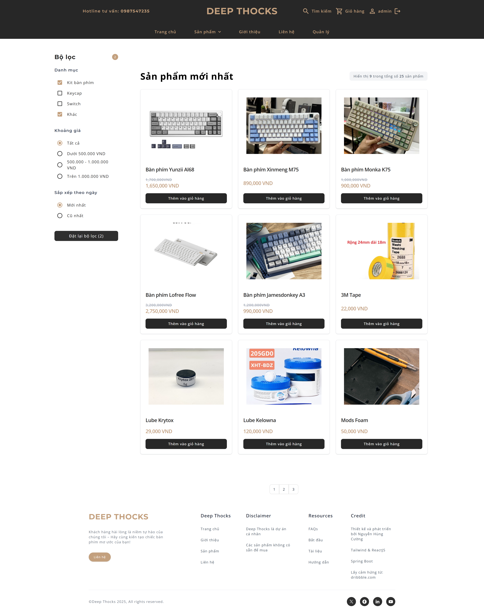
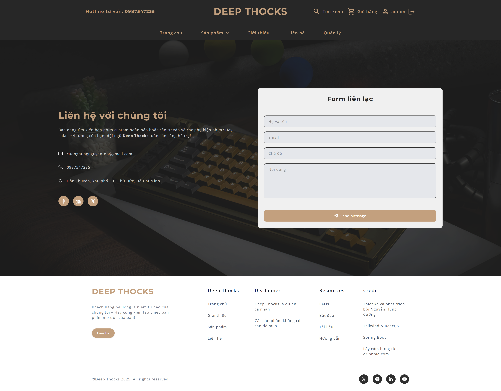
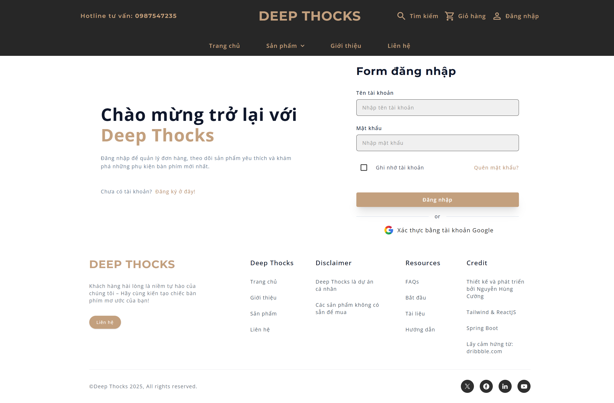
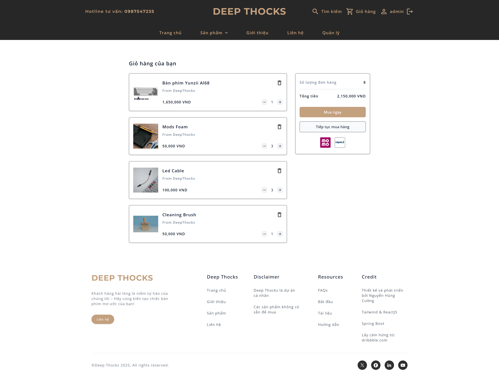
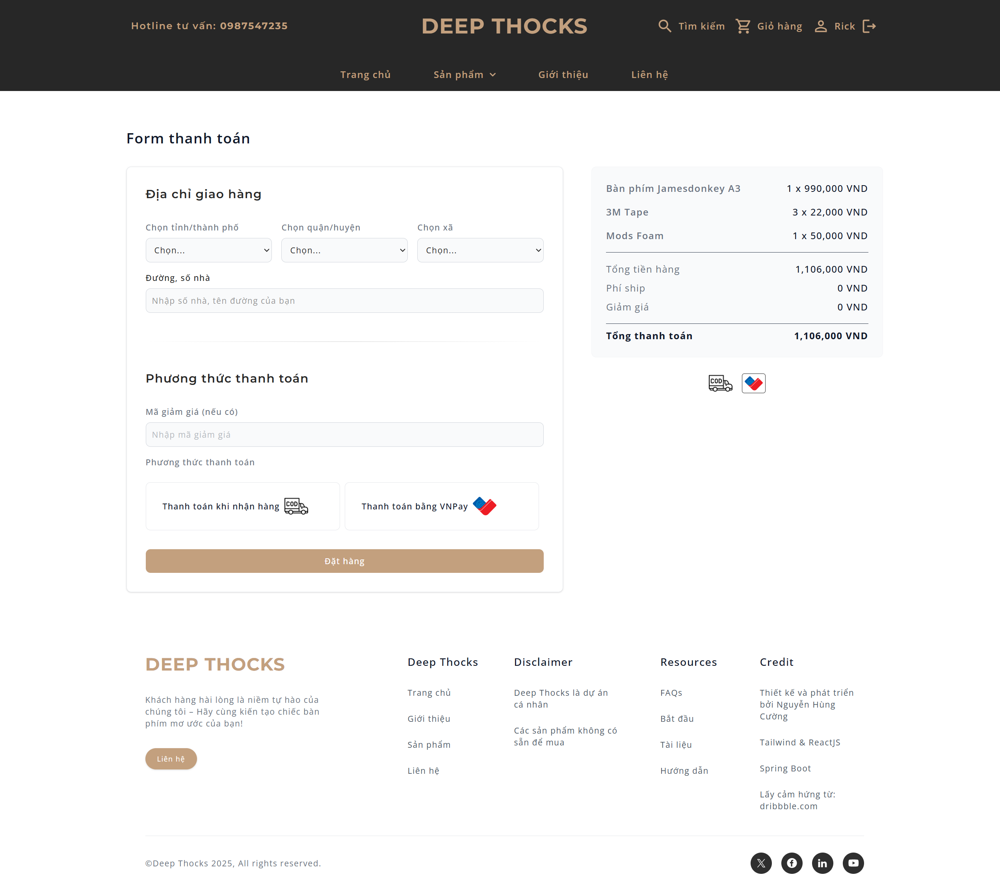
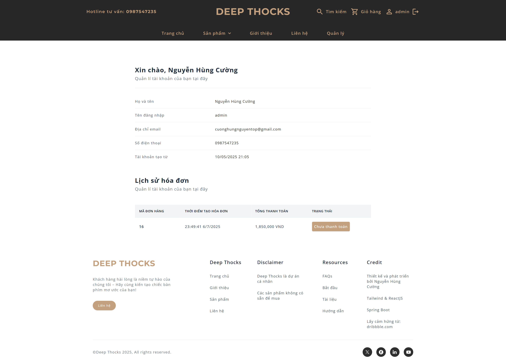
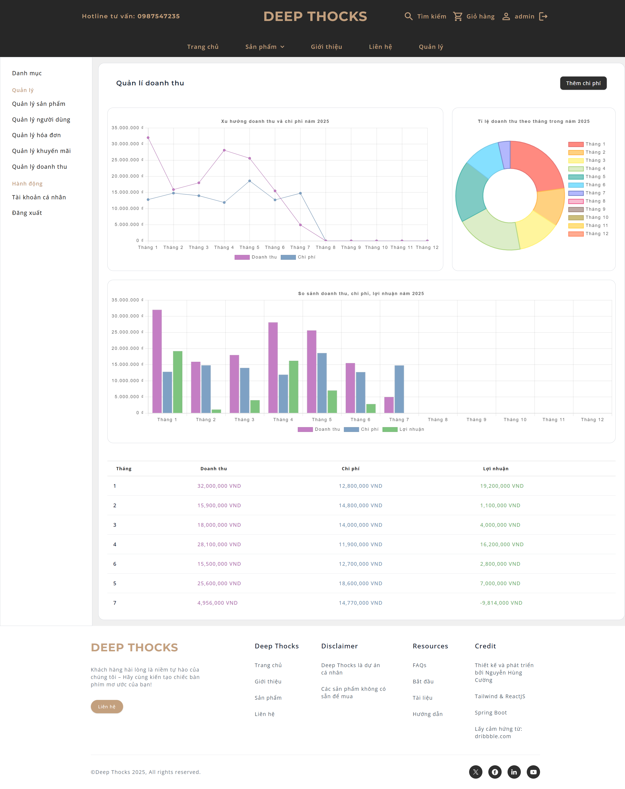
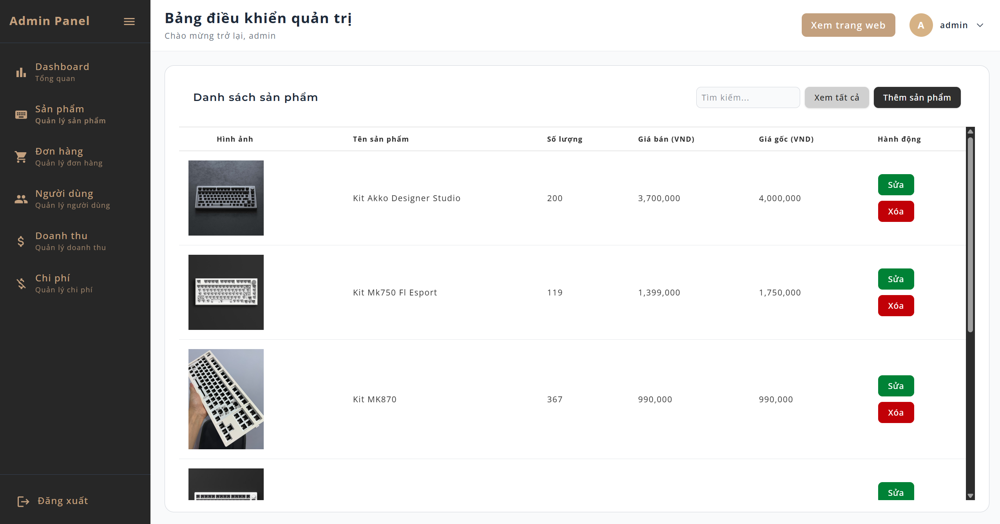
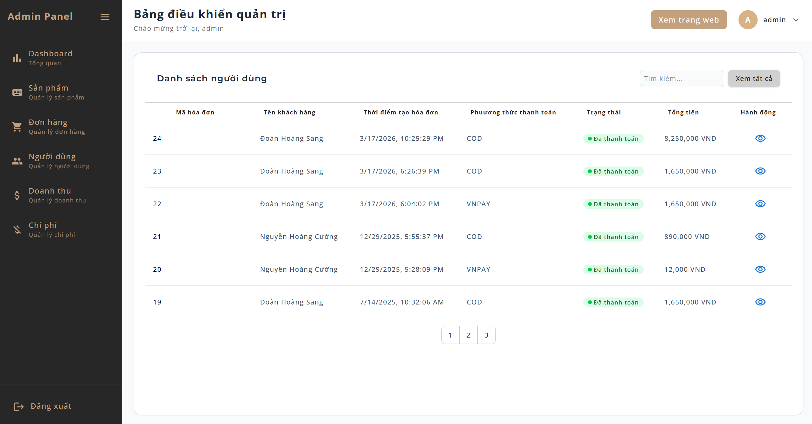
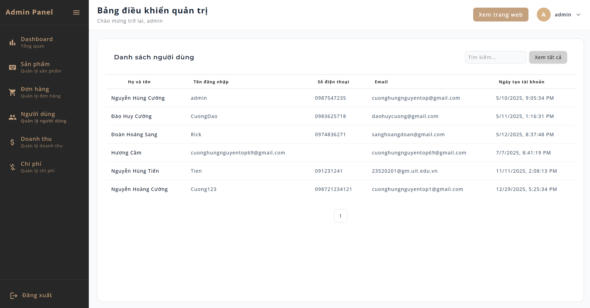

# ⌨ DEEP THOCKS

Một ứng dụng E-commerce chuyên bán bàn phím cơ, được phát triển dựa trên **ReactJS** và **Spring Boot**. Tên "Deep Thocks" lấy cảm hứng từ âm thanh "Thocky" đặc trưng của bàn phím cơ, mang đến trải nghiệm mua sắm trực tuyến mượt mà và chuyên nghiệp cho những người đam mê bàn phím cơ.

🔗 **Link Repository**: [https://github.com/NguyenHungCuongg/Deep-Thocks](https://github.com/NguyenHungCuongg/Deep-Thocks)

## 📖 Mục lục

- [Giới thiệu](#giới-thiệu)
- [Công nghệ sử dụng](#công-nghệ-sử-dụng)
- [Yêu cầu hệ thống](#yêu-cầu-hệ-thống)
- [Hướng dẫn cài đặt và chạy ứng dụng](#hướng-dẫn-cài-đặt-và-chạy-ứng-dụng)
- [Thông tin tài khoản](#thông-tin-tài-khoản)
- [Giao diện](#giao-diện)
- [Đóng góp](#đóng-góp)
- [Liên hệ](#liên-hệ)

## Giới thiệu

**Deep Thocks** là một nền tảng thương mại điện tử được thiết kế để cung cấp các sản phẩm bàn phím cơ, bao gồm kits, switches, keycaps, và phụ kiện liên quan. Ứng dụng hỗ trợ các tính năng như quản lý sản phẩm, giỏ hàng, đơn hàng, và xác thực người dùng bằng JWT. Với thiết kế hiện đại và giao diện thân thiện, Deep Thocks hướng đến việc mang lại trải nghiệm tốt nhất cho người dùng yêu thích bàn phím cơ.

Ứng dụng được triển khai thông qua **Docker**, đảm bảo tính nhất quán và dễ dàng thiết lập trên các môi trường khác nhau.

## Công nghệ sử dụng

Deep Thocks được xây dựng với các công nghệ hiện đại:

- **Frontend**:

  - **ReactJS**: Thư viện JavaScript để xây dựng giao diện người dùng.
  - **TailwindCSS**: Framework CSS để thiết kế giao diện responsive và hiện đại.
  - **Vite**: Công cụ build nhanh và hiệu quả cho frontend.

- **Backend**:

  - **Java Spring Boot**: Framework Java để xây dựng API RESTful mạnh mẽ và bảo mật.
  - **PostgreSQL**: Cơ sở dữ liệu quan hệ để lưu trữ thông tin người dùng, sản phẩm, và đơn hàng.
- **API bên thứ 3**:
  - **OAuth2 Google**: Xác thực bằng tài khoản Google
  - **VNpay**: Hỗ trợ thanh toán trực tuyến bằng VNpay   

- **Triển khai**:
  - **Docker**: Container hóa ứng dụng để dễ dàng triển khai và quản lý.

## Yêu cầu hệ thống

Để chạy ứng dụng, bạn cần cài đặt:

- **Docker**: Phiên bản 20.10 trở lên.
- **Docker Compose**: Phiên bản 1.29 trở lên.
- Hệ điều hành: Windows, macOS, hoặc Linux.
- RAM: Tối thiểu 4GB (khuyến nghị 8GB).
- Kết nối internet (để pull image PostgreSQL và build container).

## Hướng dẫn cài đặt và chạy ứng dụng

### 1. Clone repository

Clone dự án từ GitHub về máy của bạn:

```bash
git clone https://github.com/NguyenHungCuongg/Deep-Thocks.git
cd Deep-Thocks
```

### 2. Chạy ứng dụng

Chạy lệnh sau để khởi động tất cả các service:

```bash
docker-compose up --build
```

Để dừng ứng dụng:

```bash
docker-compose down
```

### 3. Lưu ý

- File `DeepThocksDatabaseQuery.sql` trong thư mục `docs/` sẽ tự động được chạy để khởi tạo cơ sở dữ liệu khi container `db` khởi động lần đầu.
- Đảm bảo các thư mục `backend/` và `frontend/` chứa mã nguồn đầy đủ trước khi build.

## Thông tin tài khoản

Để đăng nhập vào hệ thống, sử dụng tài khoản admin mặc định:

- **Username**: `admin`
- **Password**: `123`

**Lưu ý**: Tài khoản này dùng để quản trị hệ thống. Bạn có thể tạo thêm tài khoản khách hàng (`CUSTOMER`) thông qua API hoặc giao diện quản trị.

## Giao diện
### Trang chủ


### Trang sản phẩm


### Trang giới thiệu


### Trang liên hệ


### Trang đăng nhập


### Trang giỏ hàng


### Trang thanh toán hóa đơn


### Trang hồ sơ


### Trang quản lý doanh thu (dành cho admin)


### Trang quản lý sản phẩm (dành cho admin)


### Trang quản lý hóa đơn (dành cho admin)


### Trang quản lý người dùng (dành cho admin)


## Đóng góp

Chúng tôi hoan nghênh mọi đóng góp để cải thiện dự án! Để đóng góp:

1. Fork repository này.
2. Tạo một branch mới: `git checkout -b feature/your-feature-name`.
3. Commit các thay đổi: `git commit -m 'Add your feature'`.
4. Push lên branch: `git push origin feature/your-feature-name`.
5. Tạo Pull Request trên GitHub.

Vui lòng đảm bảo mã nguồn tuân thủ coding standards và bao gồm test case nếu có.

## Liên hệ

Nếu bạn có câu hỏi hoặc cần hỗ trợ, liên hệ:

- **Email**: cuonghungnguyentop@gmail.com
- **GitHub Issues**: [https://github.com/NguyenHungCuongg/Deep-Thocks/issues](https://github.com/NguyenHungCuongg/Deep-Thocks/issues)
- **Facebook** : [https://www.facebook.com/cuong.nguyen.813584/](https://www.facebook.com/cuong.nguyen.813584/)
- **Linkedin** : [https://www.linkedin.com/in/c%C6%B0%E1%BB%9Dng-nguy%E1%BB%85n-76153a333/](https://www.linkedin.com/in/c%C6%B0%E1%BB%9Dng-nguy%E1%BB%85n-76153a333/)

Cảm ơn bạn đã quan tâm đến **Deep Thocks**!
